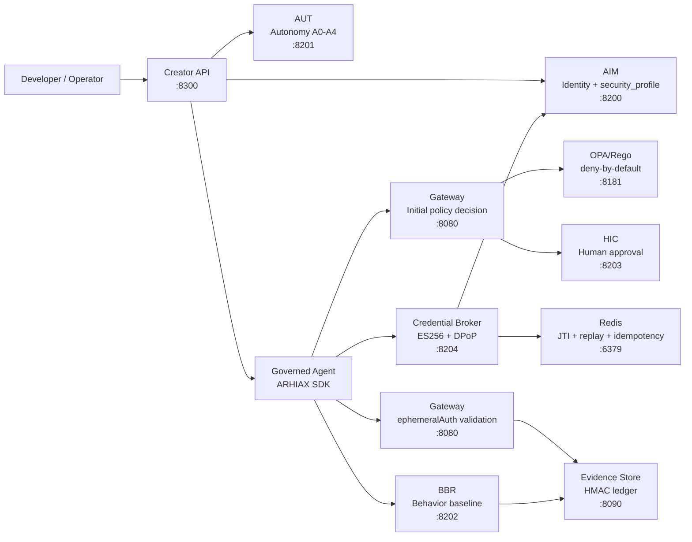
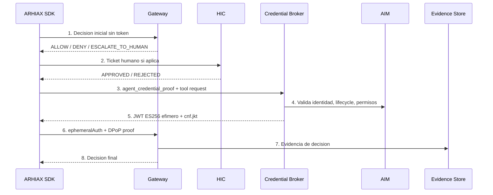

# ARHIAX AgentCreator


-v11.5-0f4c81)


Fabrica corporativa de agentes de IA gobernados bajo el estandar ARHIA(X). Un agente creado por ARHIAX no nace como script suelto: nace con identidad, autonomia, politica, auditoria, aprobacion humana y autorizacion efimera por accion.

> Estado actual: repo listo para commit/push. Lo que queda pendiente se coloca al momento de desplegar: secretos reales, certificados mTLS, Redis persistente, URLs del entorno y, si aplica, Vault/PostgreSQL.

## Snapshot Ejecutivo

| Pilar | Estado | Implementacion |
| --- | --- | --- |
| Creacion gobernada | LISTO | Creator API + AIM + AUT |
| Runtime policy | LISTO | Gateway + OPA/Rego |
| Tokens efimeros | LISTO | Credential Broker + DPoP + JWKS |
| Human-in-the-loop | LISTO | HIC Service + SDK step-up |
| Evidencia | LISTO | Evidence Store HMAC + compliance report |
| Observabilidad | LISTO | Metrics + anomalies endpoint |
| Produccion | PARAMETRIZADO | `.env.production.example` + `PRODUCTION-READINESS.md` |
| Alta concurrencia | ROADMAP | SQLite WAL hoy; PostgreSQL recomendado para carga enterprise |

## Arquitectura Visual



## Que Hace Diferente A ARHIAX

```text
Agente tradicional
  token amplio + logs + prompt/contexto + confianza implicita

Agente ARHIAX
  identidad AIM + autonomia AUT + decision OPA + token efimero
  + DPoP + proof firmado + HIC + evidencia HMAC + replay protection
```

La capa de seguridad de tokens efimeros evita que un token robado sea util como bearer token reutilizable. El token no vive en el prompt ni en documentos procesados por el modelo; se inyecta en la capa runtime/tool call y queda vinculado a `scope`, `aud`, `jti`, `invocation_id`, `context_binding` y `cnf.jkt`.

## Flujo Seguro De Una Tool



## Servicios

| Servicio | Puerto | Rol |
| --- | ---: | --- |
| `creator-api` | 8300 | Fabrica de agentes gobernados |
| `gateway` | 8080 | Policy Enforcement Point, JWT/DPoP, replay y evidencia |
| `credential-broker` | 8204 | Emision de tokens efimeros por accion |
| `aim-service` | 8200 | Identidad, credenciales, lifecycle y `security_profile` |
| `aut-service` | 8201 | Autonomia A0-A4 y puertas de promocion |
| `bbr-service` | 8202 | Behavioral Baseline Registry |
| `hic-service` | 8203 | Human-in-the-loop checkpoints |
| `evidence-store` | 8090 | Ledger append-only HMAC |
| `opa` | 8181 | Motor de politicas Rego |
| `redis` | 6379 | Replay, revocacion e idempotencia |

## Inicio Rapido

```bash
cp .env.example .env
bash scripts/generate-certs.sh
docker compose up -d
docker compose ps
```

Crear un agente gobernado:

```bash
curl -X POST http://localhost:8300/v1/agents/create \
  -H "Content-Type: application/json" \
  -d '{
    "name": "MiPrimerAgente",
    "department_id": "dept-operaciones",
    "supervisor_id": "supervisor-humano-001",
    "permitted_tools": ["consultar_datos", "generar_reporte"],
    "permitted_operations": ["modelInvoke", "toolCall", "interAgentCall"],
    "security_profile": {
      "token_mode": "brokered_ephemeral",
      "require_pop": true,
      "tool_token_ttl_seconds": 60,
      "high_risk_token_ttl_seconds": 30,
      "revocation_mode": "redis+jti",
      "zero_token_in_context": true,
      "enforce_broker_for_tools": true
    }
  }'
```

## Despliegue Productivo

El codigo queda listo; los valores sensibles se colocan al desplegar.

```bash
cp .env.production.example .env
# Reemplazar REQUIRED_AT_DEPLOY_* por secretos reales o configurar Vault.
bash scripts/generate-certs.sh
docker compose config --quiet
docker compose up -d
```

Inputs obligatorios de despliegue:

| Input | Variable |
| --- | --- |
| Modo produccion | `ARHIAX_PRODUCTION=true` |
| Secreto AIM | `AIM_HMAC_SECRET` o Vault `arhiax/aim#hmac` |
| Secreto Evidence | `EVIDENCE_HMAC_SECRET` o Vault `arhiax/evidence#hmac` |
| Proof firmado | `BROKER_REQUIRE_SIGNED_AGENT_PROOF=true` |
| Redis persistente | `ARHIAX_REDIS_URL` |
| URL publica Gateway | `GATEWAY_PUBLIC_URL` |
| mTLS | `ARHIAX_CA_CERT`, cert y key por servicio |

## SDK: Agente Gobernado

```python
from arhiax import ARHIAXAgent, governed_tool


class AgenteDeAnalisis(ARHIAXAgent):
    agent_id = "agent-abc123"
    gateway_url = "https://gateway:8080"
    credential_broker_url = "https://credential-broker:8204"

    @governed_tool(resource="consultar_datos", severity="MEDIUM", autonomy_level="A1")
    async def consultar_datos(self, case_id: str) -> dict:
        return {"case_id": case_id, "status": "ok"}
```

Variables TLS/mTLS del SDK:

```bash
export ARHIAX_CA_CERT=/certs/ca.crt
export ARHIAX_TLS_CLIENT_CERT=/certs/agent.crt
export ARHIAX_TLS_CLIENT_KEY=/certs/agent.key
export ARHIAX_GATEWAY_URL=https://gateway:8080
export ARHIAX_CREDENTIAL_BROKER_URL=https://credential-broker:8204
```

## Evidencia Y Validacion

```bash
python -m pytest services/gateway/tests -q
python -m pytest services/credential-broker/tests -q
python -m pytest services/creator-api/tests -q
python -m pytest services/aim-service/tests -q
python -m pytest services/aut-service/tests -q
python -m pytest services/bbr-service/tests -q
python -m pytest services/hic-service/tests -q
python -m pytest services/evidence-store/tests -q
PYTHONPATH=sdk/python python -m pytest sdk/python/tests -q
docker compose config --quiet
```

Controles operativos post-deploy:

```bash
curl http://localhost:8204/.well-known/jwks.json | python -m json.tool
curl http://localhost:8080/metrics | grep arhiax_gateway_jti_store_backend
curl http://localhost:8090/v1/evidence/verify/chain | python -m json.tool
curl http://localhost:8080/v1/anomalies | python -m json.tool
```

## Documentacion Clave

| Documento | Proposito |
| --- | --- |
| `STANDARD-v11.5-MAPPING.md` | Mapeo canonico contra el estandar ARHIA(X) v11.5 |
| `PRODUCTION-READINESS.md` | Estado release-ready y variables que solo se colocan al desplegar |
| `SECURITY.md` | Modelo de seguridad y checklist pre-produccion |
| `ARCHITECTURE.md` | Arquitectura y flujo runtime |
| `DEPLOYMENT.md` | Despliegue local/productivo |
| `API_REFERENCE.md` | Endpoints principales |
| `docs/ADR-ARHIAX-001-Tokens-Efimeros-y-Delegacion-Gobernada.md` | ADR formal de la capa |
| `docs/ARHIAX_Arquitectura_de_Seguridad_Tokens_Efimeros_y_ADR.docx` | Version DOCX corporativa |

## Estado De Produccion

| Categoria | Estado |
| --- | --- |
| Codigo y tests | Listo |
| Compose | Listo |
| Seguridad runtime | Listo |
| Documentacion v11.5 | Listo |
| Secretos reales | Se colocan al desplegar |
| Certificados reales | Se colocan al desplegar |
| Backend alta concurrencia | Roadmap PostgreSQL |

## Licencia

ARHIAX AgentCreator - Sinergia Consulting Group.
Sistema de gobernanza y seguridad para agentes IA bajo estandar ARHIA(X).
